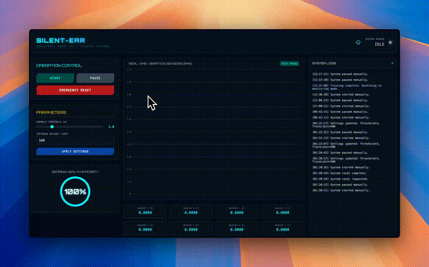

# 🔊 Silent-Ear

[](https://github.com/mrsarac/silent-ear/actions/workflows/ci.yml)
[](https://www.rust-lang.org/)
[](https://opensource.org/licenses/MIT)

**Industrial Edge AI Anomaly Detection System for Predictive Maintenance**

Silent-Ear is a lightweight, high-performance agent that analyzes vibration data from industrial machinery to detect bearing faults *before* catastrophic failure occurs.

> 🏭 *"Your factory's sense of hearing."*

> ⚠️ **Disclaimer:** This software is provided for **demonstration and educational purposes only**. It is not certified for industrial safety-critical applications. Do not use for life-safety or mission-critical systems without proper validation and certification. See [LICENSE](LICENSE) for full terms.

## ✨ Features

- **🚀 High Performance** — Processes 40M+ data points in under 1.5 seconds
- **🧠 Statistical AI** — Uses Mean + 3σ anomaly detection (no heavy ML frameworks)
- **❤️ Health Scoring** — Real-time 0-100% health score for machine degradation
- **🔌 REST API + WebSocket** — JSON endpoints + real-time updates
- **📊 Live Dashboard** — Built-in HTML5 visualization with WebSocket
- **🐳 Docker Ready** — Multi-arch (AMD64 + ARM64) one command deployment
- **🍓 Raspberry Pi Ready** — Native ARM64 support for edge deployment

## 🎬 Demo



*Real-time anomaly detection with health scoring and live visualization*

## 🚀 Quick Start

### Option 1: Docker (Recommended)

```bash
# AMD64 (x86_64)
docker run -p 3000:3000 ghcr.io/mrsarac/silent-ear:latest

# Or with docker-compose
docker-compose up -d
# Open http://localhost:3000
```

### Option 2: Raspberry Pi (ARM64)

```bash
# Docker on Raspberry Pi 4/5
docker run -p 3000:3000 ghcr.io/mrsarac/silent-ear:latest

# Or download pre-built binary
curl -LO https://github.com/mrsarac/silent-ear/releases/latest/download/silent-ear-linux-arm64.tar.gz
tar -xzf silent-ear-linux-arm64.tar.gz
./silent-ear-linux-arm64 --mock
```

### Option 3: From Source

```bash
# Prerequisites: Rust 1.83+
git clone https://github.com/mrsarac/silent-ear.git
cd silent-ear

# Download NASA IMS dataset (optional, for full simulation)
# Place in data/ims/1st_test/1st_test/

# Run simulation
./run.sh
# or
cargo run --release -- --simulate

# Or with mock data (no dataset needed)
cargo run --release -- --mock
```

## 🏗️ Architecture

```
┌─────────────┐    ┌─────────────┐    ┌─────────────┐
│   Sensors   │───▶│ DSP Engine  │───▶│  Detector   │
│ (Vibration) │    │ (RMS Calc)  │    │ (3σ Rule)   │
└─────────────┘    └─────────────┘    └──────┬──────┘
                                             │
                                    ┌────────▼────────┐
                                    │  Health Score   │
                                    │   (0-100%)      │
                                    └────────┬────────┘
                                             │
                   ┌─────────────────────────▼─────────────────────────┐
                   │                 Web Interface                     │
                   │  REST API (/api/status)  │  Dashboard (HTML5)    │
                   └───────────────────────────────────────────────────┘
```

See [docs/ARCHITECTURE.md](docs/ARCHITECTURE.md) for detailed documentation.

## 📡 API Reference

### GET /api/status

Returns current system state.

```json
{
  "current_file": "2003.10.22.12.06.24",
  "health_score": 0.94,
  "status": "WARNING",
  "latest_readings": [0.142, 0.156, 0.138, 0.487, ...],
  "is_training": false
}
```

### POST /api/control

Control the simulation.

```json
{ "action": "start" }  // or "stop", "reset"
```

### POST /api/settings

Configure detector parameters.

```json
{
  "threshold": 3.0,
  "train_limit": 500
}
```

### GET /metrics

Prometheus metrics endpoint for observability integration.

```
# HELP silent_ear_health_score Current health score (0.0 to 1.0)
# TYPE silent_ear_health_score gauge
silent_ear_health_score 0.94

# HELP silent_ear_samples_processed_total Total number of samples processed
# TYPE silent_ear_samples_processed_total counter
silent_ear_samples_processed_total 1500
```

## 🔌 MQTT Integration

Enable MQTT publishing for industrial IoT integration:

```bash
# Run with MQTT enabled
./silent-ear --mock --mqtt

# Configure broker via environment
MQTT_HOST=broker.local MQTT_PORT=1883 ./silent-ear --mock --mqtt
```

**Topics:**
- `silent-ear/health` - Health score updates (JSON)
- `silent-ear/alerts` - Critical alerts with retained messages

## 📊 Dataset

This project uses the **NASA IMS Bearing Dataset** (Set No. 2):
- 4 bearings monitored continuously until failure
- 20,480 samples per reading at 20 kHz
- Bearing 4 fails at end of test (outer race defect)

[Download Dataset](https://www.nasa.gov/content/prognostics-center-of-excellence-data-set-repository)

## 🧪 Testing

```bash
cargo test
```

```
running 42 tests
test detector::tests::test_new_detector ... ok
test detector::tests::test_train_detector ... ok
test detector::tests::test_anomaly_detection ... ok
test detector::tests::test_health_score ... ok
test websocket::tests::test_broadcaster_broadcast ... ok
test mqtt::tests::test_mqtt_config_default ... ok
test metrics::tests::test_health_score_metric ... ok
... (35 more tests)

test result: ok. 42 passed; 0 failed
```

## 🛠️ Tech Stack

| Component | Technology |
|-----------|------------|
| Language | Rust 🦀 |
| Async Runtime | Tokio |
| Web Framework | Axum |
| DSP | Native (RMS calculation) |
| AI | Statistical Process Control |

## 🗺️ Roadmap

- [x] WebSocket real-time updates
- [x] Raspberry Pi / ARM64 support
- [x] Multi-arch Docker images
- [x] MQTT integration (industrial IoT)
- [x] Prometheus metrics export (`/metrics`)
- [ ] Real hardware sensor support (ADXL345)
- [ ] OPC-UA support (factory automation)
- [ ] Machine learning with Burn framework

## 🤝 Contributing

See [CONTRIBUTING.md](CONTRIBUTING.md) for guidelines.

## 📄 License

MIT License - see [LICENSE](LICENSE) for details.

## 🏢 About

Part of the **NeuraByte Labs** ecosystem — Building autonomous AI systems that interact with the physical world.

---

*Built with 🦀 Rust in Germany*
