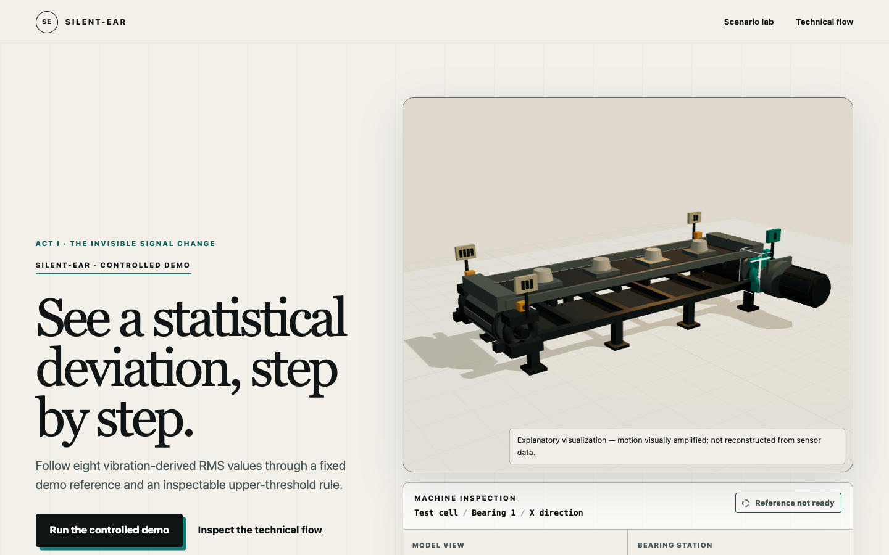

# Silent-Ear

[](https://github.com/neurabytelabs/silent-ear/actions/workflows/ci.yml)
[](https://www.rust-lang.org/)
[](LICENSE)

**An open-source Rust demonstrator that turns eight vibration channels into per-window RMS values and compares them with a fixed statistical reference, so you can see how a simple mean + kσ rule behaves.**

[**Live demo**](https://silent-ear.neurabytelabs.com/) · [Technical flow](docs/experience/PRODUCT_TRUTH.md) · [QA report](docs/experience/QA_REPORT.md)



> **Educational software.** Silent-Ear is a demonstration. It does not diagnose faults, identify damage, predict failure or estimate remaining life, and it is not certified for safety-critical industrial use. See [Limits](#limits).

## What it does

- Reads up to eight channels of raw vibration samples (tab-separated files, e.g. the NASA IMS bearing set) and computes **one RMS value per channel per file**.
- Learns a **fixed reference** (per-channel mean and population standard deviation) from the first `train_limit` readings.
- Flags a channel when its RMS is **strictly above** `mean + k·σ` (default `k = 3`). The rule is upper-only.
- Reports a heuristic **deviation score** (0–100%) derived from the largest absolute z-score. It is not a probability and not a physical health measure.
- Serves the result over **REST**, **WebSocket**, optional **MQTT** and **Prometheus-format** metrics.
- Ships an interactive **browser explainer**: a procedural 3D conveyor test cell with four bearing stations, eight channels, scenario stepping and an exploded-signal view. It runs on a fixed, synthetic fixture and needs no backend.

## How it works

```
 raw samples (files)  ─┐
                       ├─▶  RMS per channel  ─▶  reference (first N readings)  ─▶  mean + k·σ  ─▶  score + status
 mock data (--mock)   ─┘     (8 channels)         mean, population σ, then fixed     upper, strict >      REST · WebSocket
                                                                                                       MQTT · /metrics
```

1. **Input:** `--simulate` reads files from `data/ims/...`; `--mock` generates eight synthetic RMS-like values.
2. **RMS:** `sqrt(sum(x²) / n)` per channel per file.
3. **Reference:** the first `train_limit` readings (default 500) set the mean and σ. They are not updated afterwards; a reset retrains.
4. **Comparison:** per channel, `x > mean + k·σ` marks a threshold event. Equality is not an event.
5. **Score:** `1` while the largest absolute z-score is at or below `k`, falling linearly to `0` at `15σ`.

Details and exact formulas: [docs/experience/PRODUCT_TRUTH.md](docs/experience/PRODUCT_TRUTH.md).

## Quick start

Prerequisites: Rust 1.83+ and, only if you rebuild the web page, Node 22.

```bash
git clone https://github.com/neurabytelabs/silent-ear.git
cd silent-ear

# Run with synthetic data (no dataset needed), then open http://localhost:3000
cargo run --release -- --mock

# Run against the NASA IMS dataset (download it first, see "Dataset")
cargo run --release -- --simulate
```

Rebuild the browser experience (output goes to `static/`, which the server serves):

```bash
npm ci
npm run lint && npm run typecheck && npm test
npm run build
```

A `Dockerfile` and `docker-compose.yml` are included. The Docker build is exercised by the CI workflow on release tags; it was not run as part of the latest verification.

## API

| Endpoint | Purpose |
|---|---|
| `GET /api/status` | Current state: file, score, status, latest eight readings, training flag |
| `POST /api/control` | `{"action": "start" \| "stop" \| "reset"}` |
| `POST /api/settings` | `{"threshold": 3.0, "train_limit": 500}` |
| `GET /metrics` | Prometheus-format metrics |
| WebSocket | State broadcasts (see `src/websocket.rs`) |

Optional MQTT: `./silent-ear --mock --mqtt` with `MQTT_HOST`, `MQTT_PORT`, `MQTT_CLIENT_ID`; topics `silent-ear/health` and `silent-ear/alerts`.

## Measured performance

Only what was measured is stated here.

| Check | Result | Conditions |
|---|---|---|
| RMS stage throughput | **40.96 M values in 1.29–1.44 s** (3 runs, ~29 M values/s) | Apple M3 Pro, release build, 250 synthetic IMS-format files (20,480 rows × 8 columns), warm file cache, `FileDataSource::calculate_rms` only. Excludes API, dashboard and the simulation's built-in pacing delays. Not yet measured on the real IMS files or on a Raspberry Pi. |
| Rust tests | 42 / 42 pass | `cargo test --locked`; `cargo clippy -D warnings` and `cargo fmt --check` clean |
| Frontend tests | 47 / 47 pass | Vitest; ESLint and `tsc --noEmit` clean |
| Browser page, warm playback | 53.4 fps desktop (1440×900), 60 fps mobile viewport (390×844) | Headless Chromium with software WebGL, see [QA report](docs/experience/QA_REPORT.md). Cold start showed long tasks of up to ~920 ms in that environment. |
| Page weight | 709 kB JavaScript (193 kB gzip) | Single chunk, no external runtime assets |

## Limits

- **No real sensor support yet.** Input is file-backed samples or synthetic values. Hardware acquisition (e.g. ADXL345) is on the roadmap, not implemented.
- **No validation against real faults.** The detector is a statistical comparison with a fixed baseline. It has not been calibrated or validated on a bench or in the field, so it makes no claim about fault detection, fault type, damage, remaining life or lead time before failure.
- **Fixed baseline.** The reference does not adapt to drift, load or speed changes.
- **Two sign conventions.** The threshold event is upper-only; the score uses the absolute z-score. They can disagree, and the demo labels them separately.
- **The browser demo is a fixture.** It replays a controlled synthetic scenario; motion is visually amplified and not reconstructed from sensor data. It does not read from `/api/status`.
- **Not certified** for safety-critical use. See [LICENSE](LICENSE).

## Dataset

The simulation mode expects the [NASA IMS Bearing Dataset](https://www.nasa.gov/content/prognostics-center-of-excellence-data-set-repository) placed under `data/ims/` (20,480 samples per reading at 20 kHz). The dataset is not included and is not needed for `--mock` or for the browser demo.

## Roadmap

- [x] REST, WebSocket, MQTT, Prometheus export
- [x] ARM64 build configuration and multi-arch Dockerfile
- [x] Interactive browser explainer
- [ ] Real hardware sensor input (ADXL345)
- [ ] Calibrated bench measurements and a written validation protocol
- [ ] OPC-UA

## Contributing

See [CONTRIBUTING.md](CONTRIBUTING.md).

## License

MIT, see [LICENSE](LICENSE).

Part of [NeuraByte Labs](https://neurabytelabs.com).
